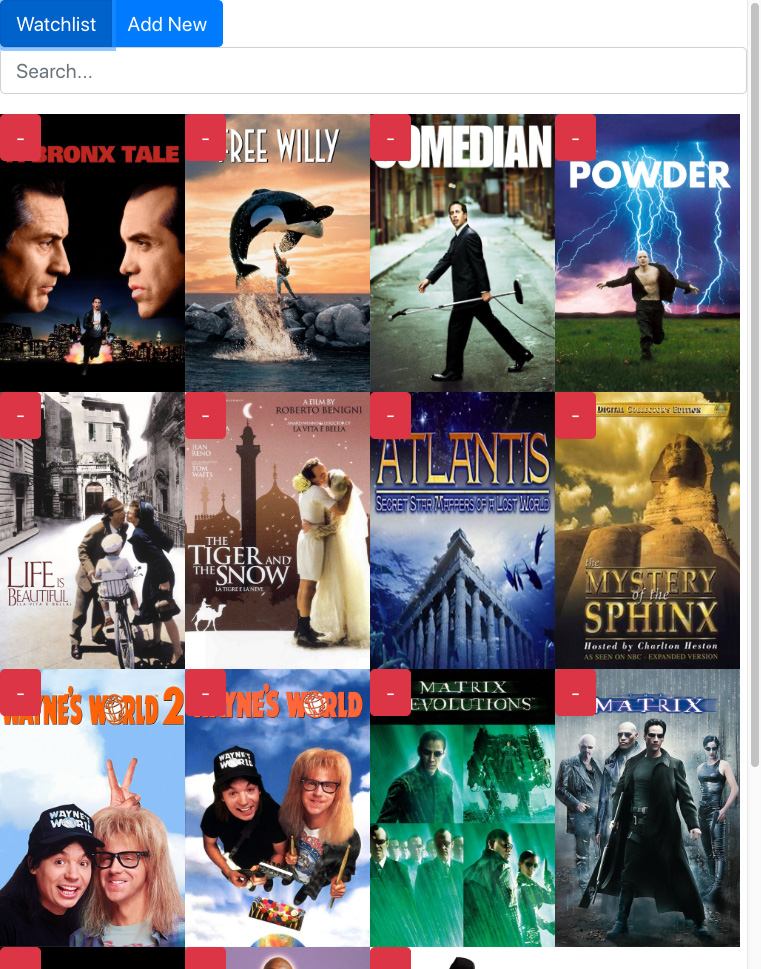
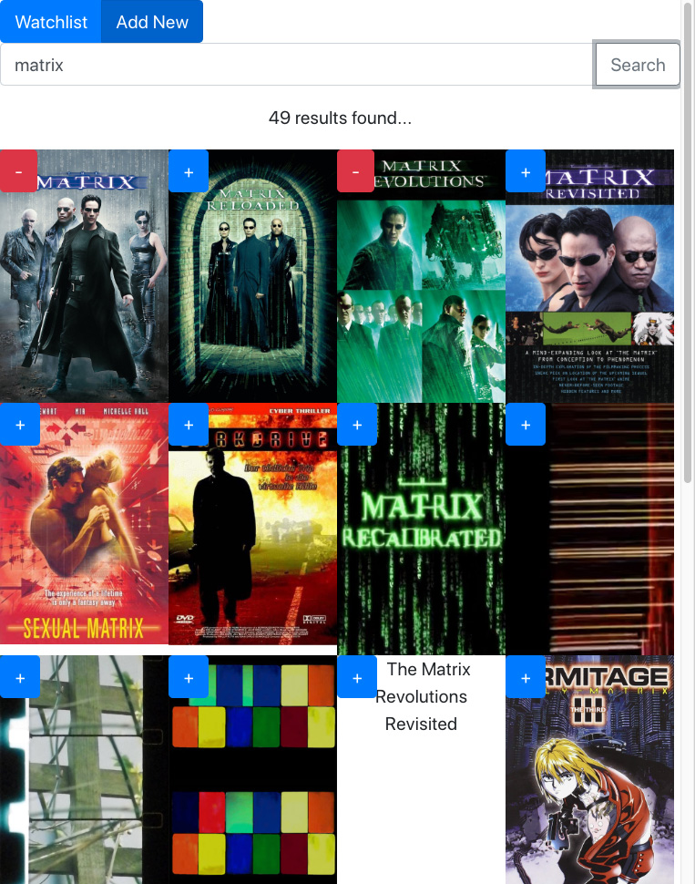

# Watch-with-Me

This app aims to make it easier to find something to watch: specifically, a group of friends trying to find something to watch together.
It serves as a unified watchlist for multiple streaming services and multiple friends.

## Main Features

##### Phase 0

- Create users
- Add friends
- Search all movies by title
- User can add/remove movies from their watchlist
- Users can view their watchlist
- Users can filter their watchlist for similarities with friends

##### Phase 1

- Password authentication for users
- Expand movies to view details
- Adding friend requires approval (unless enabled in user settings)

##### Phase 2

- Expand selection to include shows
- Link media to streaming services

##### Phase 3

- Detailed search (by genre, actor, release date, etc)
- Add available streaming services / preferences to user profiles
- Detailed filtering of watchlist (streaming services, genre, etc)
- View user's friends' watchlists
- Suggest media to friends

##### Phase 4

- Dark/night Mode

##### Phase 5

- Import/View watchlists from streaming services

##### Phase 6

- Users can send each other messages

## Getting Started

While in development, run (in order):

### `npm install`

Installs dependencies needed for app

### `npm start-db`

Starts the database

### `npm run watch`

Builds the app and watches for changes to update

### `npm start`

Serves the app on port 3000

### `npm start-dev`

Serves the app through a proxy server
> Go to localhost:8080 in any browser.

## Usage

- Enter username
- Search movies by title
- Add/remove movies from watchlist from any view
- Go to Settings to add/remove friends, change username, change picture
- Filter watchlist/search by movies in friends' watchlists

## Screenshots (Phase 0)

## Thoughts for Future Improvements

- Ability to block users
- Consider deeper connection to external APIs (for reviews, etc.)
- Add a history of watched items
- Import ratings/history from streaming services if possible
- Create cloud player or other system to allow friends to share streaming-services (unless this is illegal)
- Create parent filters
- Support multiple languages
- Understand what is available based on current location (since streaming availability can depend on region)

## Additional Information

- This app was created by Eric Callari as a personal project in 2019.  If you like it, great!! Wanna give me a job? lol jk not really tho.
- This app is not monetized in any way and is open-sourced and available to anyone (please credit me and use responsibly/ethically).
- Please reduce, reuse, and recycle.
